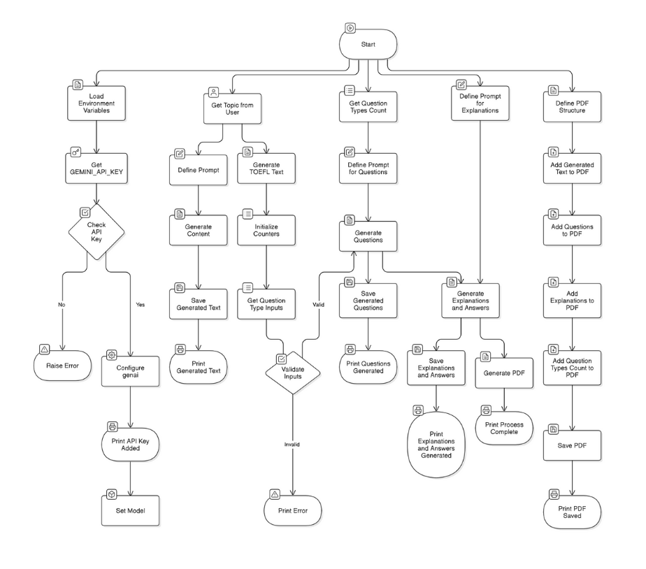

# TOEFL Reading Question Generator

## Overview

The **TOEFL Reading Question Generator** is a tool designed to generate TOEFL iBT-style reading passages, questions, and answers. The application leverages advanced AI models to produce high-quality academic content, enabling students and educators to create personalized practice tests.

#### Workflow Diagram:



## Features

- **Generate TOEFL Reading Passages**: Create passages based on a user-defined topic.
- **Customizable Question Types**: Specify the number of each TOEFL question type (e.g., Factual Information, Inference, Vocabulary, etc.).
- **Detailed Explanations and Answers**: Automatically generate explanations and correct answers for each question.
- **Export to PDF**: Save the generated passage, questions, and answers in a well-formatted PDF.

## Project Structure

```
toefl_question_generator/
├── assets/                     # Assets such as images or additional resources
├── datasets/                   # Placeholder for any datasets used in development
├── README.md                   # Documentation for the project
├── TOEFL_Reading_Content.pdf   # Sample generated PDF
├── requirements.txt            # Python dependencies
├── model.ipynb                 # Jupyter Notebook version of the core script
├── toefl_reading_gr.py         # Gradio interface script
├── toefl_reading_practise.py   # Main script for generating content
```

## Installation

1. Clone the repository:

   ```bash
   git clone https://github.com/your-username/toefl_question_generator.git
   cd toefl_question_generator
   ```

2. Create a virtual environment:

   ```bash
   conda create --name your_env_name python=3.9  # Replace `your_env_name` with your preferred environment name.
   conda activate your_env_name
   ```

3. Install the dependencies:

   ```bash
   pip install -r requirements.txt
   ```

4. Set up your environment variables:
   - Create a `.env` file in the project root and add your Gemini API key:
     ```
     GEMINI_API_KEY=your_api_key
     ```

## Usage

### Run the Gradio Interface

1. Start the Gradio app:

   ```bash
   python toefl_reading_gr.py
   ```

2. Open the provided local or public URL in your browser to access the app.

### Generate TOEFL Reading Practice in Python

1. Import the `generate_toefl_text` function:

   ```python
   from toefl_reading_practise import generate_toefl_text
   ```

2. Generate a passage:

   ```python
   topic = "The Impact of Climate Change on Arctic Wildlife"
   passage = generate_toefl_text(topic)
   print(passage)
   ```

3. Customize question generation by combining the passage with question type counts and explanation prompts.

## Example Output

1. **Generated Passage**:

   ```
   The Arctic is undergoing rapid changes due to climate change...
   ```

2. **Generated Questions**:

   ```
   1. What is the primary reason for the decline in Arctic wildlife populations?
      A) Overhunting
      B) Habitat loss due to climate change
      C) Pollution
      D) Competition for resources
   ```

3. **Generated Explanations and Answers**:

   ```
   Answer: B
   Explanation: The passage highlights that habitat loss due to melting ice is a major threat...
   ```

4. **PDF Export**: All generated content can be downloaded as a PDF file.
